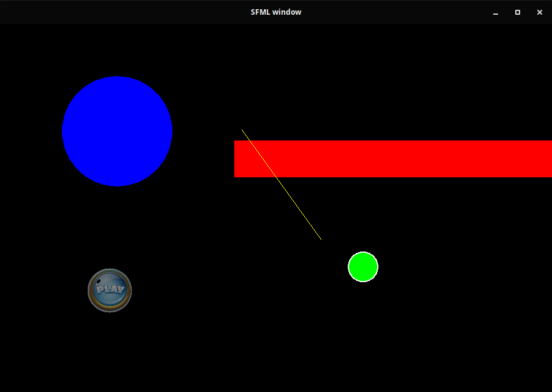
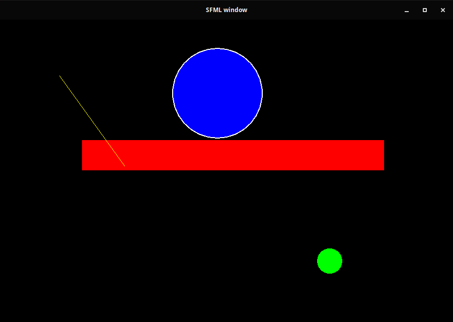

# Factory

_README met screenshots gemaakt ivm met niet langs kunnen gaan voor aftekenen(corona quarantine)_

De functie ScreenObjectRead maakt een aantal Unique_ptrs van het type drawable(super klasse van de verschillende vormen), en zet deze vervolgens in een vector.

Drawable bevat een aantal gedeelde functies die elk van de type vormen gebruiken, waaronder draw,move en de verschillende Write Functies, die de huidige status (na het bewegen) weer terug zet in de text file.

De Boolean Selected, wordt gebruikt voor het bewegen van de verschillende objecten. Omdat er maar een object tegerlijk mag bewegen, worden deze geselecteerd(dit wordt graphisch weergegeven door een witte outline op de vormen). Als een object geslecteerd is kan er vervolgens ergens binnen de window geklikt worden om het object te bewegen, en het volgende object word automatisch geselecteerd. Als een object niet bewogen hoeft te worden kan er op de toets 'N' worden gedrukt, hierdoor wordt het volgende object geslecteerd.

## File informatie
|    Bestand    |                                    Doel                                    |
| :-----------: | :------------------------------------------------------------------------: |
| Drawable.hpp  |                    Superclas voor vormen uit shapes.hpp                    |
| Execption.hpp |          Exeptions die voor functionering van factory nodig zijn.          |
|  factory.hpp  | Factory pattern die de text file decode en pointers maakt voor de objecten |
|  Shapes.hpp   |                de verschillende vormen voor schermobjecten                 |
|   list.txt    |                   text file voor lezen/opslaan objecten                    |
## Keybindings
|     knop      |                     actie                     |
| :-----------: | :-------------------------------------------: |
|      'N'      |             Selecteer Next object             |
| 'Linker Muis' | Beweeg geselecteerde object naar muis positie |

# Screenshots

Groene Bal Geselecteerd

Blauwe Ball Geselecteerd

