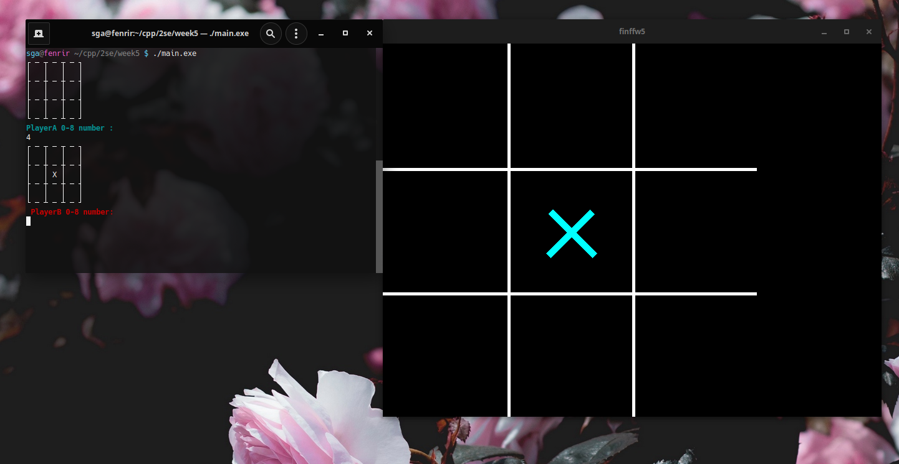
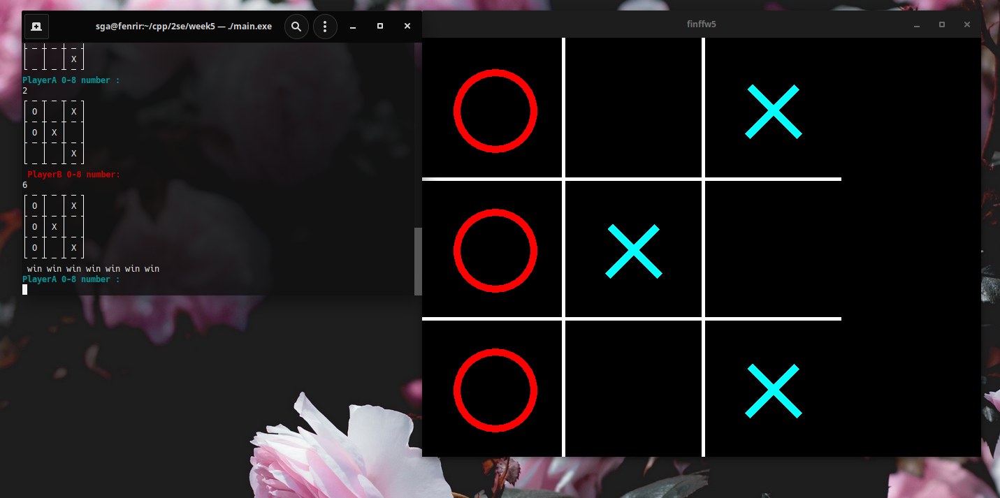
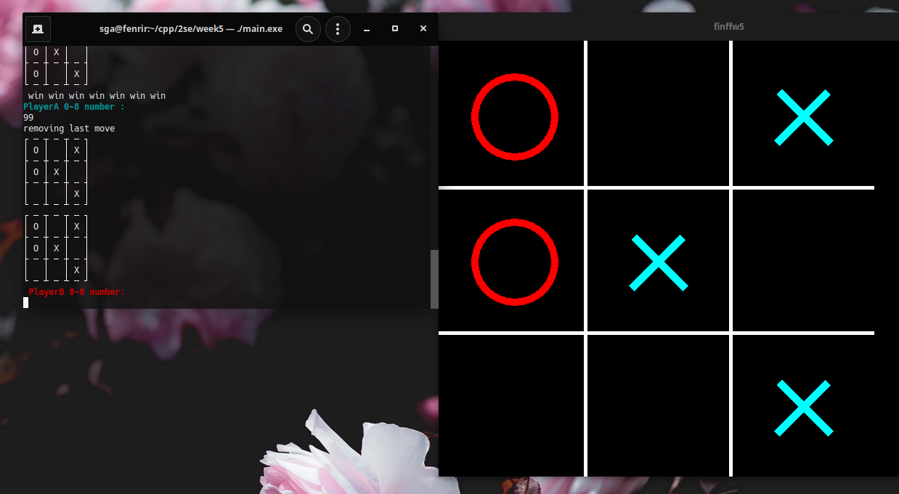

# Tic Tac toe

_README met screenshots gemaakt ivm met niet langs kunnen gaan voor aftekenen(corona quarantine)_

De gamestate bestaat uit een een serie van <std::pairs> (positie, state(kruisje/rondje/leeg)) die in een <std::stack> worden opgeslagen. Hierdoor zou je elke zet kunnen *Undo'en*, en weer op nieuw te beginnen.
De GUI versie maakt op basis van deze stack een aantal new pointers en voegt deze toe aan een <std::vector<drawable *>> en laat deze zien. De terminal/CLI versie haalt de states en posities uit de stack, en zet ze in een array voor het controleren van de win condition.

| knop |                 actie                  |
| :--: | :------------------------------------: |
| 0-8  | Plaats op plek op bord(zie hier onder) |
| '99' |            Undo laatste zet            |

#### Plaats op bord
|     |     |     |
| --- | --- | --- |
| 0   | 1   | 2   |
| 3   | 4   | 5   |
| 6   | 7   | 8   |

# screenshots
start zet

playerB win

Undo van laatste zet

